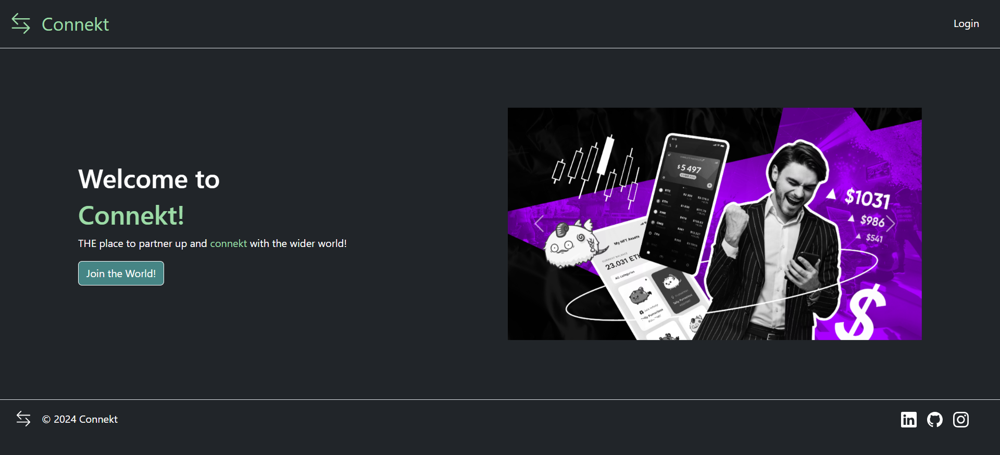
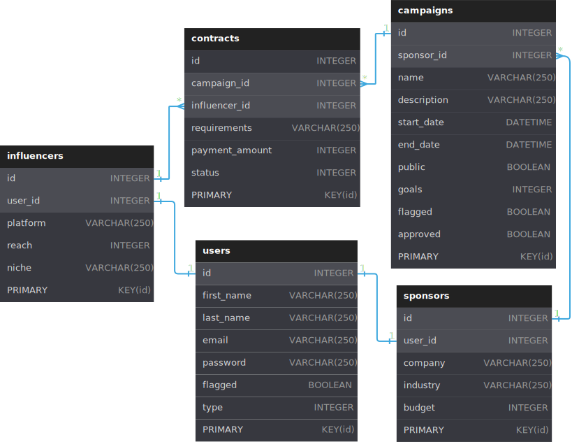

# Connekt - The Connection Hub

## Student Details:

- Name: Kaiwalya Deshpande
- Email: 21f1002355@ds.study.iitm.ac.in

## Influencer Sponsorship Platform

### Problem Statement

It is a platform to connect Sponsors and influencers so that sponsors can get their product/service advertised and influencers can get monetary benefit.

### My approach

For this, I implemented a website with frontend using Vue3 and backend with flask. I believe that it fulfilled all the needs of the skeleton on the website intended. I began with building a rough sketch of pages in the frontend and slowly built the corresponding logic in the backend along with it. Step by step building the backend apis and the frontend for each page accordingly. The interactions between tables have been shown below in the ER Diagram.

### Frameworks and Libraries Used

- Frontend:
  - Vue3 - As the main JS framework
  - Bootstrap5 - For the CSS Styling
  - Vue-router - For routing multiple components
  - Vuex - For frontend state management
  - Axios - For communicating with the backend
  - ChartJS - For building beautiful charts
- Backend:
  - Flask - As the main web framework
  - Flask-SQLalchemy - For database management
  - Flask-JWT-Extended - For user authentication and authorization
  - Celery - For asynchronous backend jobs
- Database:
  - SQLite - For storing the database
- Caching:
  - Redis - For data broker of celery

### ER Diagram

### Video Demonstration

[Click Here](https://drive.google.com/drive/folders/1PD1xbsI5luRQNON2dSY_1ShZNLL66sX1?usp=sharing "Drive Link access only for IITM")
to access view the video demonstration of the project.
